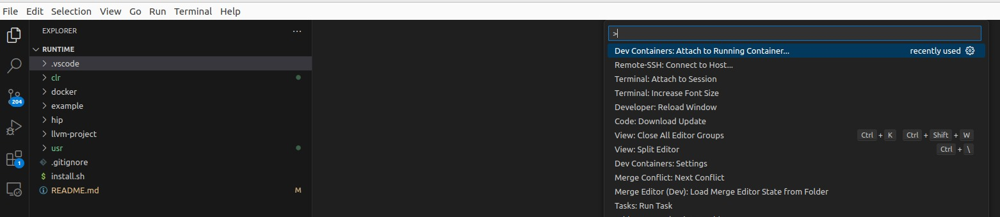

# Learn By Debugging / Together We Advance_CLR

## Introduction

The ROCm software stack is open-source and, thus, [publicly available](github.com/ROCm/ROCm). This gives a unique opportunity for researchers, industry experts, students and enthusiasts to dive into and study implementations of different GPU software components - i.e., compilers, AI/HPC and runtime libraries. For example, one can freely change or modify some algorithms of a particular component of ROCm to reach their research or business goals.


The AMD ROCr System Runtime is language independent and makes heavy use of the Heterogeneous System Architecture ([HSA](https://hsafoundation.com/wp-content/uploads/2021/02/HSA-Runtime-1.2.pdf)) Runtime API which is a well-established, not-for-profit industry standard. This approach provides a rich foundation to execute programming languages, such as HIP and OpenMP, and/or develop new Domain Specific Languages on the top of the AMD ROCr System Runtime.

I am going to demostrate how to setup your first debugging session for the AMD runtime libraries in this tutorial. I believe this is going to help you to start your exciting journey to the ROCm software ecosystem.

## Preparation Steps

I am going to show all steps inside a docker container since it is one of the most reproducible ways to share software. Our container, which we are about to build, is going to contain all necessary tools for compiling and debugging the runtime libraries. 

### Obtaining Files and Scripts

```bash
$ git clone https://github.com/ravil-mobile/clr-dbg-blog.git clr-dbg-blog
$ cd ./clr-dbg-blog
$ WORK_DIR=$(realpath .)
```

### Building Docker Image and Spin Container

Make sure that you are using one of the latest `Docker` installations.
I am using `Docker` v27 in this tutorial.

```bash
$ docker -v
Docker version 27.0.3, build 7d4bcd8
```

Let's build our Docker image for debugging and development.

```bash
$ cd ${WORK_DIR}
$ cd ./docker
$ ./gen-env-file.sh
$ docker compose build --no-cache
$ docker compose up -d
```

Now, we are going to jump into a running container and perform the rest of the steps inside.  

```bash
$ docker exec -it docker-clr_dev-1 /bin/bash
```

## Building Common Language Runtimes (CLR)

Let's discover the version of the current ROCm installation and
setup some useful environment variables.

```bash
$ VERSION=$(apt show rocm-libs -a | grep Version: | xargs)
$ MAJOR=$(echo $VERSION | cut -d'.' -f1 | cut -d':' -f2 | xargs)
$ SEMIMAJOR=$(echo $VERSION | cut -d'.' -f2)
$ MINOR=$(echo $VERSION | cut -d'.' -f3 | cut -d'-' -f1)
$ GIT_BRANCH="rocm-${MAJOR}.${SEMIMAJOR}.x"

$ cd ${WORK_DIR}
$ INSTALL_DIR="$(realpath .)/usr"
$ mkdir -p ${INSTALL_DIR}
```

Unfortunately, ROCm installation comes without the `ClangConfig.cmake`
file which was generated during compilation of the `amdclang` compiler - i.e.,
it is wiped off during the ROCm packaging process. This file is needed to compile
the CLR libraries. Thus, we need to compile `amdclang` compile from sources to
get corresponding `cmake` configuration file.

```bash
$ cd ${WORK_DIR}
$ git clone --depth=1 -b ${GIT_BRANCH} https://github.com/ROCm/llvm-project.git llvm-project
$ cd ./llvm-project
$ mkdir -p build && cd build
$ cmake ../llvm  -DCMAKE_BUILD_TYPE=Release \
-DLLVM_ENABLE_ASSERTIONS=ON \
-DLLVM_TARGETS_TO_BUILD="host;AMDGPU" \
-DLLVM_ENABLE_PROJECTS="clang;lld;compiler-rt" \
-DCMAKE_INSTALL_PREFIX=${INSTALL_DIR}
$ make -j8
$ make install
```

Additionally, we need to install HIPCC becuase it is a dependency for some of the CLR libs.

```bash
$ cd ${WORK_DIR}
$ cd ./llvm-project/amd/hipcc
$ mkdir -p build && cd build
$ cmake .. -DCMAKE_INSTALL_PREFIX=${INSTALL_DIR}
$ make -j8
$ make install
```

Moreover, we need to HIP headers which we can fetch from the official `ROCm/HIP` github repository.

```bash
$ cd ${WORK_DIR}
$ git clone -b ${GIT_BRANCH} https://github.com/ROCm/HIP.git hip
$ HIP_DIR=$(realpath ./hip)
```

Finally, we can install a debug version of the CLR libraries. This can be done as follows:

```bash
$ cd ${WORK_DIR}
$ git clone -b ${GIT_BRANCH} https://github.com/ROCm/clr.git
$ cd clr
$ mkdir -p build && cd build
$ cmake .. -DCLR_BUILD_HIP=ON \
-DCMAKE_BUILD_TYPE=Debug \
-DCLR_BUILD_OCL=OFF \
-DHIP_COMMON_DIR="${HIP_DIR}" \
-DHIPCC_BIN_DIR="${INSTALL_DIR}/bin" \
-DCMAKE_PREFIX_PATH="/opt/rocm;/opt/rocm/llvm;${INSTALL_DIR}" \
-D__HIP_ENABLE_PCH=OFF \
-DCMAKE_EXPORT_COMPILE_COMMANDS=ON \
-DCMAKE_INSTALL_PREFIX="${INSTALL_DIR}"
$ make -j8
$ make install
```

## Compiling Provided HIP-program

Now, it is time to compile the provided sample program. We need to make sure that our
*debug* version of `libamdhip64.so` is properly linked to the program.
The provided [CMakeFile](./example/CMakeLists.txt) should handle the linking process correctly if you provide
a correct path to the `HIP` installation using the `HIP_PATH` environment variable. 

```bash
$ cd ${WORK_DIR}
$ mkdir ./example/build && cd ./example/build
$ HIP_PATH=$(realpath ${WORK_DIR}/usr) CC=/opt/rocm/llvm/bin/clang CXX=/opt/rocm/llvm/bin/clang++ cmake ..
$ make VERBOSE=1
```

You can use `ldd` utility to make sure that linking is done properly. You can check to
which concrete file `libamdhip64.so.6` points.

```bash
$ ldd ./saxpy
        linux-vdso.so.1 (0x00007fffc3fa6000)
        libamdhip64.so.6 => /home/ravil/work/runtime/usr/lib/libamdhip64.so.6 (0x000072cd1b600000)
        libstdc++.so.6 => /lib/x86_64-linux-gnu/libstdc++.so.6 (0x000072cd1b3d4000)
        libm.so.6 => /lib/x86_64-linux-gnu/libm.so.6 (0x000072cd1bd83000)
        libgcc_s.so.1 => /lib/x86_64-linux-gnu/libgcc_s.so.1 (0x000072cd1bd63000)
        libc.so.6 => /lib/x86_64-linux-gnu/libc.so.6 (0x000072cd1b1ab000)
        librocprofiler-register.so.0 => /opt/rocm-6.2.0/lib/librocprofiler-register.so.0 (0x000072cd1bcdf000)
        libamd_comgr.so.2 => /opt/rocm-6.2.0/lib/libamd_comgr.so.2 (0x000072cd124ee000)
        libhsa-runtime64.so.1 => /opt/rocm-6.2.0/lib/libhsa-runtime64.so.1 (0x000072cd121d0000)
        libnuma.so.1 => /lib/x86_64-linux-gnu/libnuma.so.1 (0x000072cd1bcd2000)
        /lib64/ld-linux-x86-64.so.2 (0x000072cd1be72000)
        libz.so.1 => /lib/x86_64-linux-gnu/libz.so.1 (0x000072cd1bcb6000)
        libtinfo.so.6 => /lib/x86_64-linux-gnu/libtinfo.so.6 (0x000072cd1219e000)
        libelf.so.1 => /lib/x86_64-linux-gnu/libelf.so.1 (0x000072cd1bc96000)
        libdrm.so.2 => /opt/amdgpu/lib/x86_64-linux-gnu/libdrm.so.2 (0x000072cd12184000)
        libdrm_amdgpu.so.1 => /opt/amdgpu/lib/x86_64-linux-gnu/libdrm_amdgpu.so.1 (0x000072cd1bc86000)
```

Run the sample program to make sure that everything works correctly.

```bash
$ ./saxpy
System minor 3
System major 10
Agent prop name AMD Radeon PRO W6600
HIP Device prop succeeded 
VERIFICATION PASSED
```

## Starting Debugging Session

The `.vscode` folder contains all configuraion files that I prepared for you to start a debugging session with `Visual Studio Code` (vscode).
We need `Dev Containers`, `C/C++` and `clangd` extention for vscode. Open `vscode`, attach the current session to our running container (using `Dev Containers`) and navigate to `${WORK_DIR}` directory.

Open the prompt by pressing `F1` and perform the following steps.




Perform source code indexing for better user experience while working with the CLR source code. Execute `clangd: Restart language server` in the vscode prompt.


Now, we need to set a breakpoint somewhere in the CLR source code. I would recommend to start the debugging process from `rocvirtual.cpp:3320`. This is the place where the runtime library is about to send a kernel packet to a device for execution.


Now, we are ready to start the debugging session. Type `Ctrl+Shift+D` followed by `F5`.


If all steps are done correctly your vscode session will look like the image above. On the left side, you will see all local variables and their current values (which you can inspect), as well as the current state of the call stack at the bottom. You can wall through the call stack and investigate all function calls which brought us to `rocvirtual.cpp:3320`.

At this point, you have all bits and pieces to continue your research or investigation regarding the AMD's Common Language Runtime libraries or HSA. You can add new functionalities to the runtime libraries or/and modify something, re-compile and test them. 

I wish you a nice journey through our runtime libraries. I am sure there is tons to learn regarding how modern GPU software stack, compilers and drivers are interoperating between each other under the hood.

*Best Regards,*

*Ravil Dorozhinskii*
